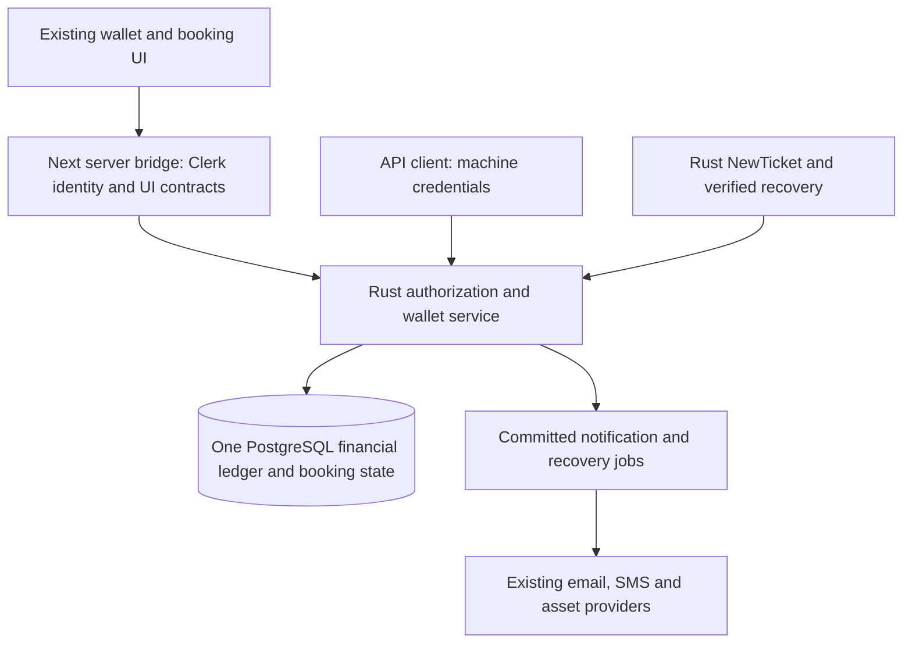

# Fresh Rust Wallet — Reviewed Implementation Plan

- **Reviewed:** 16 September 2026
- **Status:** Implementation in progress. Fresh Rust kernel, client reads and portal service workflows pass isolated tests; frontend cutover and complete feature parity remain pending.
- **Backend:** `shapontravels` — Rust / PostgreSQL
- **Frontend:** `shopontravels` — existing Next.js UI / Clerk login

## 1. সিদ্ধান্ত ও কাজের সীমা

Existing wallet-এর UI ও functionalities রেখে fresh Rust wallet তৈরি হবে। পুরোনো balance, ledger, deposit, adjustment, refund বা active hold copy করা হবে না। নতুন wallet-এর opening available এবং hold balance হবে **0**। নতুন approved deposit/credit থেকে ব্যবহার শুরু হবে।

Client-এর জন্য **Get Balance** ও **Statement** API থাকবে। Portal এবং API client একই Rust wallet service ও একই ledger ব্যবহার করবে। Normal flight flow থাকবে **Search → RePrice → Book → NewTicket**; NewTicket-এর আগে automatic PNR call যোগ হবে না।

এই document-এ review findings, proposed contracts, implementation order ও completion criteria লেখা হয়েছে। এটি wallet চালু, টাকা credit/debit, supplier operation বা production cutover করার রেকর্ড নয়।

### Implementation checkpoint — 16 September 2026

| Phase | Current evidence | Remaining before phase exit |
| --- | --- | --- |
| 0 | [Contract and caller inventory](WALLET_CONTRACT_INVENTORY.md); ownership, precision, freeze and independent reviewer policies recorded | Keep the inventory current during adapter work |
| 1 | Migrations 29–31; exact money; zero provisioning; immutable ledger; atomic reserve/capture/release/refund cap; runtime privilege and concurrency tests pass | Complete wider workflow race coverage during integration |
| 2 | `wallet:read`, Balance and snapshot-paginated Statement; owner/scope/filter tests; staged portal routes and actual HTTP contracts pass | Client onboarding/mapping UI and full activation checks |
| 3 | Existing forms and server-rendered loaders wired under isolated preview; five deposit channels, versioned settings/assets, sender snapshots and lost-response receipt recovery pass real HTTP tests | Browser parity and snapshot-aware orphan asset cleanup |
| 4 | Report/review/freeze adapters plus migration 32 recipient outbox, one-attempt provider adapters, status/retry/resend UI and financial-isolation tests pass | Operator/browser checks, scheduler configuration and controlled delivery UAT at activation |
| 5 | Native and staged portal Issue reserve accepted payable; immediate/verify/reconcile finalizers capture the same operation; unknown keeps funds; browser and concurrent/lost-response/capture-failure tests pass without redispatch or normal PNR | Two-person manual non-issuance release is implemented for completed unknown issues; pending/crashed-worker proof and wider operational recovery remain before phase exit |
| 6 | Kernel refund ceiling exists | Approved refund/reissue/void and imported/manual consumer bindings are not implemented |
| 7 | Staged wallet route/page adapters, stable browser submission IDs, role/owner/origin guards and safe numeric converters pass integration tests; legacy fallback is blocked in preview | Running portal still uses existing backend; full consumer parity, browser checks and cutover pending |
| 8 | Tests use disposable local databases and synthetic data | Fresh activation, complete UAT, operational checks and rollback rehearsal pending |

**Portal issue contract:** [Owner-bound issue and recovery](PORTAL_TICKET_WALLET.md); [test and browser evidence](evidence/FRESH_WALLET_PORTAL_ISSUE_2026-09-16.md).

**Notification evidence:** [Recipient delivery and recovery checkpoint](evidence/FRESH_WALLET_NOTIFICATIONS_2026-09-16.md); [configuration and operator runbook](../../shopontravels/docs/RUST_WALLET_NOTIFICATIONS.md).

**Portal adapter evidence:** [16 September adapter checkpoint](evidence/FRESH_WALLET_PORTAL_2026-09-16.md), [frontend setup and limits](../../shopontravels/docs/RUST_WALLET_PORTAL.md).

**Current activation boundary:** The running portal has not been switched to the new wallet. No old financial data has been imported. This checkpoint must not be presented as a completed wallet migration. New backend builds require a mapped, funded Rust account for native held NewTicket; existing supplier/UAT/production gates remain in force.

### Agreed scope

- Preserve existing wallet pages, navigation, forms, labels, financial permissions and supported workflows. API adapters and state handling may change without redesigning the UI.
- Implement financial rules and authoritative storage in Rust and its PostgreSQL database now.
- Reuse authenticated user/agency identities; create new financial accounts linked to those identities.
- Keep financial amounts, reservations, ledger entries, approvals and audit records under one Rust authority.
- Keep the existing Search/RePrice/Book behavior and integrate wallet authorization into held-ticket issue.
- Preserve wallet functionality for newly created records, including deposit channels, payment settings, statements, reporting, adjustments, refunds and notifications.

### Fresh start boundary

- Create new wallet tables within the Rust application's PostgreSQL database. Do not reinitialize the entire database or erase existing Rust bookings, users, configuration or supplier evidence.
- Import no historical financial data and create no fabricated opening-credit entries.
- Re-enter company bank/MFS accounts, payment settings and owner saved bank accounts through the supported setup flows. These are configuration tasks, not an automatic copy of old records.
- Old Supabase wallet records do not become a second balance source or an automatic fallback.
- Existing login, agency identity, supplier configuration and unrelated product features are outside the financial reset.
- A legacy ticket without a corresponding new-ledger charge cannot receive a refund from the new wallet by assuming it was paid. Existing held/unknown bookings need explicit eligibility rules before financial attachment; an unknown Book outcome remains blocked from issue.
- Credit limits, overdrafts, wallet-to-wallet transfers, currency conversion and new payment gateways are outside this request.
- Wallet work does not itself enable currently disabled B2C, sub-user booking, Direct Issue or production supplier execution.

Identity follow-up, 2026-09-16: the user has separately authorized moving application identity/agency/security to Rust. Follow [Rust identity requirements and phases](RUST_IDENTITY_REQUIREMENTS_PLAN.md). Clerk login remains; the existing agency-directory dependency is replaced only after that plan's cutover gate passes. The staged identity foundation does not yet switch wallet ownership resolution or authorize historical financial imports.

## 2. What the code review established

| Area | Observed implementation | Consequence for this work |
| --- | --- | --- |
| Wallet storage | Next server helpers call Supabase tables and wallet RPCs | Replacing the balance endpoint alone cannot complete the backend move |
| Financial ownership | B2B owner/sub-user resolves to an agency wallet; operational staff do not own personal wallets | Rust needs an immutable owner mapping shared by portal and API clients |
| Money representation | Existing wallet UI/storage adapters use integer minor units; Rust pricing retains exact quote amounts | Define conversion and response units explicitly; avoid floating-point recalculation |
| Reservations | Existing wallet reservation foreign keys point to legacy Supabase bookings/attempts | A Rust booking UUID cannot simply be passed to the old functions |
| Ledger/admin reports | Some routes directly join Supabase wallets, bookings, agencies and user profiles | Reports and display-name lookups must move with the wallet adapters |
| Server-rendered UI | `UserWalletDashboard` loads payment options and saved bank accounts before rendering | Changing only `/api/wallet/*` leaves hidden legacy dependencies |
| Deposit settings | Bank, MFS, sender accounts, branch/receiver information, fees, logos and QR assets exist | Preserve these as explicit feature-parity work |
| Deposit notifications | Request and decision email/SMS, plus decision-email resend, already exist | Preserve delivery behavior separately from committed financial results |
| Rust Hold | Portal Book has no wallet debit or ticket-issue action | A successful Hold remains unpaid; Book failure does not create a wallet reservation |
| Rust NewTicket | Has durable idempotent issue records, supplier gates and saved-evidence checks; financial authorization is absent | Add wallet reservation inside the native issue service, before supplier dispatch |
| Issue recovery | Saved-response verification and report-backed reconciliation can establish ticket success separately | Every success/recovery entry point must settle the same wallet reservation |
| API permissions | Current Rust client permission validation does not include `wallet:read` | Add the scope consistently to validators, administration, token checks and API docs |
| Broader consumers | Imported/manual ticketing and ticket-management refund/reissue/void settlements use wallet operations | Inventory and integrate every retained financial consumer before declaring full parity |

**Review limit:** This is a source review of the current workspace, not a live financial audit or proof that all existing flows work in production. Existing docs that label the old wallet production-ready do not establish readiness of the proposed Rust wallet.

### Reviewed source references

- [Current wallet operations](../../shopontravels/lib/db/wallet.ts), [ownership and permissions](../../shopontravels/lib/wallet/permissions.ts), [money units](../../shopontravels/lib/wallet/money.ts).
- [Existing wallet schema](../../shopontravels/supabase/migrations/0019_wallet_core.sql), [authorization hardening](../../shopontravels/supabase/migrations/0127_generic_wallet_authorization_hardening.sql).
- [Owner wallet API](../../shopontravels/app/api/wallet/route.ts), [admin API](../../shopontravels/app/api/wallet/admin/route.ts), [ledger aggregation](../../shopontravels/app/api/wallet/ledger/route.ts), [reports](../../shopontravels/app/api/wallet/reports/route.ts).
- [Deposit workflow](../../shopontravels/app/api/wallet/deposits/route.ts), [refund route](../../shopontravels/app/api/wallet/refunds/route.ts), [payment options](../../shopontravels/lib/wallet/payment-options.server.ts).
- [Server-rendered wallet](../../shopontravels/components/dashboard/wallet/UserWalletDashboard.tsx), [wallet screens](../../shopontravels/components/dashboard/wallet), [header balance](../../shopontravels/components/dashboard/WalletBalancePopover.tsx).
- [Ticket-management wallet integration](../../shopontravels/supabase/migrations/0122_ticket_management_wallet_substrate.sql), [refund settlement](../../shopontravels/supabase/migrations/0123_ticket_management_refund_settlement.sql), [reissue settlement](../../shopontravels/supabase/migrations/0124_ticket_management_reissue_settlement.sql), [void settlement](../../shopontravels/supabase/migrations/0125_ticket_management_void_settlement.sql).
- [Rust authentication](../src/auth.rs), [portal Hold service](../src/portal_holds.rs), [native issue](../src/booking/ticketing.rs), [ticket reconciliation](../src/booking/ticket_reconciliation.rs), [current issue contract](TICKETING_API.md).

## 3. Target architecture



### Ownership and authorization

1. Provision a stable financial-owner ID and one currency account per owner/currency. Treat agency code/name as verified identity/display metadata, not browser-supplied spending authority.
2. Link the Rust API client and the portal B2B owner to the same financial owner. Multiple credentials do not create multiple wallets. Agency sub-users share their verified parent's wallet where their existing role permits wallet access.
3. Map existing standalone machine clients explicitly through administration. An unlinked client receives `WALLET_NOT_CONFIGURED`; it does not get an arbitrary wallet based on a request parameter.
4. Fresh Clerk session/role and verified membership feed the trusted portal bridge. Rust validates bridge authority, actor capability, active owner, operation and resource ownership. Browser role previews and supplied roles are never authority.
5. Preserve the existing role boundaries: owners read/request deposits; permitted staff read reports; Accounts/Admin/Super Admin perform permitted financial actions; Support is read-only for generic wallet money movement. Preserve independent requester/checker rules where currently required.
6. Staff ticketing charges the booking owner's wallet and records the actual actor. Financial account identity is immutable after an operation starts.
7. Retain existing Enterprise/API-access and suspension gates. `wallet:read` does not grant API credentials, ticketing permission or broader agency access.

### Financial invariants

- `available >= 0`, `hold >= 0`, `total = available + hold`; currency is immutable for an account and matching operation.
- Use checked integer minor units for balances and postings. BDT uses scale 2: BDT 49,746.00 = `4974600` minor units. Other currencies require an explicit supported scale; no implicit conversion.
- Obtain ticket payable from the immutable accepted Rust selling/tier-pricing snapshot. Validate it against the stored quote; do not reapply markup, use supplier cost, or accept a browser-supplied total.
- A successful balance mutation, its ledger entry, operation state and audit record commit in one database transaction. Runtime roles cannot arbitrarily update balances or rewrite/delete ledger history.
- Use stable owner/operation identities, payload hashes and database uniqueness for replay protection. Same identity/payload returns the saved result; conflicting payload returns a conflict. Different request keys cannot double-capture the same issue or exceed refundable entitlement.
- Serialize account mutations and use one documented lock order across issue, cancellation, freeze, capture, release and refund. Keep database transactions short and never hold locks across supplier HTTP calls. PostgreSQL's row locks provide the required mutation serialization. [PostgreSQL locking reference](https://www.postgresql.org/docs/current/explicit-locking.html)
- Parse money as exact decimal text and convert once to minor units with a documented scale/rounding rule. Reject unsupported precision and overflow. PostgreSQL distinguishes exact numeric types from inexact floating-point types. [PostgreSQL numeric reference](https://www.postgresql.org/docs/current/datatype-numeric.html)
- Frozen wallets reject new reservations and discretionary debits. Already-authorized reservations may still settle or release; credits/refunds remain attributable to the same owner. Finalize the precise policy in Phase 0 and enforce it under the same locks.
- This is the customer/agency wallet ledger. It does not claim to implement a complete company general ledger, supplier payable ledger or bank reconciliation system.

## 4. UI and functionality parity map

| Existing surface/functionality | Required Rust-backed behavior | Phase |
| --- | --- | --- |
| Header wallet popover, owner dashboard | Same currency formatting and available/hold/total display; fresh zero/empty state | 2, 7 |
| Owner statement and staff account ledger | Scoped history, references, filters, reliable totals and pagination | 2, 7 |
| Deposit request form | Cash, bank, bank transfer, mobile and cheque validation; proof attachments and reference fields | 3 |
| Payment configuration | Company bank/MFS accounts, branches/receivers, fee settings, logos and QR assets | 3 |
| Sender saved bank accounts | Owner isolation and existing form behavior | 3 |
| Deposit approval/rejection | Exact net credit once; reviewer audit and unchanged decision on replay | 4 |
| Manual adjustments | Existing credit/debit request/review workflow and requester/checker restrictions | 4 |
| Wallet freeze/unfreeze | Same authorized controls/reason capture, enforced by the financial service | 4 |
| Financial reports | Per-currency totals, booking payment links, deposits/adjustments and existing report views | 4, 7 |
| Ticket wallet hold/debit/release | Reserve once, settle from verified evidence and recover uncertain operations | 5 |
| Refund and post-ticket settlements | Original charged owner, remaining entitlement and request-scoped settlement | 6 |
| Request/decision notifications, resend | Existing templates/channels; durable delivery records independent of money movement | 4, 7 |

Every retained button must be backed by the new service before cutover. Balance + statement alone are an intermediate milestone, not completion of the requested functionality.

## 5. Proposed API contracts

The two client read paths below are implemented and tested in the current source. See [Wallet API](WALLET_API.md) for the implemented contract. Availability on a running server depends on deploying the matching build and migrations; the broader portal work remains in progress.

### External API clients

| Method and path | Permission | Contract |
| --- | --- | --- |
| `GET /api/wallet/balance?currency=BDT` | `wallet:read` | Own mapped account, currency/scale, status, available, hold, total and observation/version metadata |
| `GET /api/wallet/statement?currency=BDT&from=...&to=...&limit=50&cursor=...` | `wallet:read` | Own account's financial entries; bounded date range, optional type filter and stable cursor pagination |

**Money example — illustrative values, not a real account:**

```json
{
  "currency": "BDT",
  "scale": 2,
  "status": "active",
  "availableMinor": "800000",
  "holdMinor": "200000",
  "totalMinor": "1000000",
  "asOf": "2026-09-16T00:00:00Z",
  "version": "17"
}
```

- Wire amounts are integer strings to preserve precision. Existing UI adapters may convert to numeric minor units only after a safe-integer range check, or use an exact formatter. Never divide/multiply twice or display a parse failure as a zero balance.
- Statement entries include transaction ID, type, positive amount plus balance deltas, currency/scale, available/hold before and after, timestamp and permitted booking/request reference. A missing booking reference stays nullable; raw supplier references and internal financial notes are excluded.
- Default limit 50, maximum 100. Use an account ledger sequence allocated under the account mutation lock, with an opaque cursor bound to account, currency, filters and a fixed snapshot upper bound. Do not silently truncate reports to the old 500/1,000-row UI fetch limits.
- `from` is inclusive and `to` exclusive; API timestamps require UTC/explicit offsets. The portal converts Bangladesh calendar-date filters explicitly to these bounds.
- Return opening/closing available and hold balances for the requested interval from the complete ledger. A transaction-type filter narrows displayed entries; it must not redefine the account's actual balances.
- Get Balance is informative. NewTicket independently checks/reserves the current balance under a lock; clients need not call Get Balance first.
- Reads require active credentials, owner mapping, scope and rate limits. They do not create accounts, contact suppliers or mutate reservations. Account provisioning is a separate idempotent onboarding/admin operation.
- Use `Cache-Control: no-store`. Define 401 invalid authentication, 403 denied scope/access, 404 unconfigured/unavailable own account, 422 invalid filters/currency, 429 rate limit and 503 unavailable storage consistently with platform error conventions.
- Machine clients receive read endpoints. Deposit approval, adjustments, arbitrary debit/capture/release and cross-owner statements remain authorized portal/internal operations.

### Portal adapter and internal service

- Preserve the existing same-origin Next `/api/wallet/*` paths and response envelopes needed by the UI.
- Add typed, authenticated Rust portal-wallet operations for account provisioning/reads, staff lists/reports, deposits, settings, approvals, adjustments, freezes, refunds and permitted notification actions. Final internal route names belong in the Phase 0 contract inventory.
- Replace direct Supabase wallet queries in route handlers, server components, payment-option loaders, ledger/report joins, notification lookups and background jobs.
- Reuse existing Clerk and external delivery/asset providers. Rust owns wallet decisions and wallet-related metadata/jobs. Any retained Next upload/delivery transport is a thin authorized adapter, not a financial writer or a dependency on Supabase wallet rows.
- Add a portal ticket-issue bridge to the same native Rust issue service. Do not send Rust booking references into legacy supplier/booking handlers.
- Expose payment state alongside ticket state, including reserved/reconciliation/captured/released and linked operation IDs. Existing UI adapters must represent uncertain settlement accurately.
- Extend the existing owner-scoped ticket-result read to include settlement state. A fully completed issue response means verified ticket evidence and captured payment. If a ticket is evidenced but capture is still pending, return a processing/reconciliation result with both facts visible; never label the ticket as not issued or invite another NewTicket call.

## 6. Booking and wallet state rules

**Airline booking Hold** and **wallet money hold** are different records.

| Event | Wallet behavior | Supplier/booking behavior |
| --- | --- | --- |
| Search / RePrice / price acceptance | No money reservation/debit | Existing flow |
| Book returns a verified held booking | No wallet debit | Save Book references and unpaid state |
| Book returns null/failed/unknown outcome | No wallet reservation | Keep unconfirmed outcome; do not issue or resubmit automatically |
| Eligible Issue request with sufficient available funds | Atomically reserve exact payable and create/link durable issue operation | Commit authorization before any supplier dispatch |
| Insufficient balance, frozen wallet, missing mapping or invalid hold | No reservation/dispatch | Return explicit failure |
| Verified NewTicket success | Capture the reservation exactly once | Commit completed ticket state, ledger posting and reservation capture in one local transaction |
| Proven no-dispatch or verified no-ticket outcome | Release the reservation exactly once | Preserve failure/evidence; do not infer proof from a generic error |
| Timeout, malformed reply, process crash or generic supplier rejection | Keep funds reserved in reconciliation | No automatic NewTicket retry |
| Later saved-response verification/report-backed success | Capture the same reservation | Same settlement helper as the original success path |
| Ticket succeeded but local settlement is incomplete | Recover evidence/settlement without another issue | Never release simply because the database/HTTP acknowledgement was lost |
| Approved refund/void/reissue settlement | Apply approved net refund/additional charge through the same ledger | Link request and ticket entitlement; prevent duplicate/over-refund |

### Transaction and crash boundaries

1. Lock and recheck current owner/account, booking/issue eligibility, supplier controls and the accepted amount. Follow the lock order selected in Phase 0.
2. In one transaction, reserve funds, append the hold entry, record actor/owner/idempotency data and reserve the issue operation. Either all commit or none do.
3. Persist a dispatch claim before sending NewTicket. Generic outbox retry behavior must not resend an ambiguously dispatched supplier write.
4. Send exactly the six stored supplier fields. Wallet references and amounts remain internal; they are not added to Triplover's request.
5. Retain received supplier evidence and settle through one verified finalizer. Completed ticket/payment state is committed atomically; separately retained raw evidence is not a claim that payment settled. All alternate verification/reconciliation paths call this finalizer as well.
6. Recover database-only operations using their stable operation identity. An ambiguous external dispatch requires verified evidence or authorized manual reconciliation, even if the worker lease expires.

Normal issuance reads saved Book evidence and any already-verified PNR observation; it sends no automatic PNR request. Existing explicit status/deadline reads stay optional. A missing/offset-free deadline is not converted to an invented timezone. Recovery may use supported read-only evidence; if unavailable, the operation remains unresolved rather than being issued again.

**Freeze after reserve:** completion/release of the already-authorized operation must remain possible. **Deadline expiry after ambiguous dispatch:** elapsed time alone is not proof that no ticket exists and must not auto-release funds.

## 7. Phase-by-phase implementation

The table above records current implementation progress; the phase definitions below retain their original exit criteria. Each phase must produce a reviewable change plus its verification evidence before its dependent phase is enabled.

| Phase | সংক্ষিপ্ত কাজ | Completion milestone |
| --- | --- | --- |
| 0 | Existing behavior ও contracts চূড়ান্ত করা | Complete feature/consumer inventory |
| 1 | Fresh database ও money operations | Tested financial kernel |
| 2 | Client Balance/Statement এবং portal reads | One account visible through both channels |
| 3 | Payment settings ও deposit submission | All existing deposit forms supported |
| 4 | Approval, adjustment, freeze, notification ও report | Complete finance administration |
| 5 | NewTicket-এর wallet authorization ও recovery | Ticket issue cannot bypass payment |
| 6 | Refund এবং বাকি financial consumers | Every retained settlement uses the same ledger |
| 7 | Existing UI connect ও full verification | UI/functionality parity |
| 8 | UAT, fresh activation ও operational handover | Verified deployment readiness |

### Phase 0 — Freeze contracts, parity inventory and ownership policy

**Depends on:** This reviewed plan.

**Deliverables**

- Enumerate every wallet route, server loader, UI action, scheduled job and booking/ticket-management consumer; record request/response shape, role, money units, side effects and Rust replacement.
- Freeze owner/client/membership mapping, immutable account identity, supported currency scales, freeze semantics, financial caps, refund entitlements and fresh-record boundaries.
- Confirm current deposit fee/rounding behavior, role/approval matrix and reference formatting from code/tests. Resolve discrepancies between old docs and current code explicitly.
- Identify direct/manual/imported-ticket and post-ticket dependencies. Each retained workflow needs a supported Rust financial binding; it cannot silently continue mutating the old wallet.
- Choose one lock order, idempotency scope, crash-state model and public/internal API/error contracts.

**Exit criteria:** Every feature in Section 4 has a named implementation/test location; no hidden legacy wallet writer remains unclassified. Open business-policy choices are documented before coding dependent money movement.

### Phase 1 — Fresh schema and financial kernel

**Depends on:** Phase 0.

**Deliverables**

- Add additive Rust migrations for owners/client links, wallets, currency accounts, ledger entries, operations/reservations and audit protections. Allocate migration numbers at implementation time after the current sequence; do not rewrite applied migrations.
- Implement exact amounts, provision/read account, reserve, capture, release, credit and controlled debit as internal services with database constraints.
- Zero opening balances; no old financial import, sample credit or automatic funding of real users.
- Provide idempotency/result persistence, ledger sequence, payload binding, mutation permissions and lock ordering.

**Exit criteria:** Concurrent overspend, duplicate capture/release, same-key conflicts, currency mismatch, overflow, rollback and immutable-ledger tests pass against disposable PostgreSQL. Ledger deltas reconstruct account balances and unresolved reservations reconstruct hold totals.

### Phase 2 — Client Balance/Statement APIs and portal reads

**Depends on:** Phase 1.

**Deliverables**

- Implement the two external endpoints and `wallet:read` across auth/administration/OpenAPI. Retain current external API eligibility rules.
- Implement trusted portal account provisioning/read/statement operations using the same owner mapping and ledger.
- Add consistent pagination, time filters, safe projections and exact amount adapters.

**Exit criteria:** Portal and machine client read the same mapped account. Cross-owner credentials/cursors fail; frozen reads follow policy; GET makes no writes or supplier calls. Concurrent inserts do not duplicate/skip snapshot entries. UI amount formatting agrees with API values.

### Phase 3 — Payment settings and deposit submission

**Depends on:** Phases 1–2.

**Deliverables**

- Rust storage/services for company bank/MFS settings, branches/receivers and owner saved bank accounts.
- Preserve bank/transfer/cash/cheque/mobile field rules, source-account snapshots, dates, references and validated attachments/logo/QR handling.
- Recompute MFS fees from trusted configuration in exact units. Existing behavior deducts the configured rounded fee from gross to obtain net depositable amount; preserve the reviewed rounding with boundary tests.
- Store pending deposit requests idempotently. A request/attachment is not approval and creates no available balance.

**Exit criteria:** Each existing form submits and reloads correctly with fresh settings. Fee tampering, foreign saved-account/asset access, invalid proof and duplicate submission are covered. No deposit is credited before review.

### Phase 4 — Finance administration, notifications and reports

**Depends on:** Phases 1–3.

**Deliverables**

- Deposit approval/rejection, adjustment request/review, freeze/unfreeze and reason/audit fields.
- Atomic approval-to-credit and adjustment-to-ledger transitions; preserve applicable requester/checker separation.
- Staff wallet lists, per-currency totals, account ledger and financial reports from Rust, including actor/agency labels without legacy wallet joins.
- Durable email/SMS jobs for existing deposit request/decision events and explicit resend. Commit decisions before delivery; delivery failures cannot roll back or repeat credit. Deduplicate jobs and use provider deduplication where available; do not claim exactly-once message delivery across a lost provider acknowledgement.
- Preserve private attachment ownership and authorized retrieval. Reuse existing provider configuration/templates through controlled adapters.

**Exit criteria:** Duplicate/concurrent approvals credit once; rejected deposits credit zero; unauthorized/self-approval paths fail where applicable. Freeze races and notification failures are tested. Report totals match the complete ledger, not a limited first page. Real recipients are not messaged by automated local verification.

### Phase 5 — Native held-ticket wallet integration and recovery

**Depends on:** Phases 1–4; verified accepted-price/owner contracts.

**Deliverables**

- Integrate reserve-before-dispatch and verified capture/release into native `NewTicket`, using the same database as booking/issue records.
- Cover machine API calls and the new portal issue bridge. An alternate native entry point cannot bypass financial authorization.
- Connect immediate completion, captured-response verification and report-backed/manual reconciliation to the same settlement service.
- Add explicit recovery work for pending/reserved/unknown operations. No timer-driven release or automatic external redispatch after an ambiguous outcome.
- Project payment state, errors and operation identifiers into receipts/issue controls; maintain issue-versus-cancel exclusion.

**Exit criteria:** Tests cover all Section 6 cases, double clicks/different keys, concurrent bookings sharing one wallet, stale balance, owner tampering, loss of HTTP acknowledgement, crash boundaries and recovery through every verifier. Normal issuance makes zero PNR calls. No supplier dispatch occurs without a committed reservation. UAT/production gates remain effective.

### Phase 6 — Refunds and every retained settlement consumer

**Depends on:** Phases 4–5.

**Deliverables**

- Implement refund limits based on a captured charge less prior refunds and any consumed entitlement; bind every refund to its owner and approved request.
- Integrate wallet parts of retained refund/void/reissue and imported/manual ticket workflows. Additional-charge holds and approved net credits use the same financial kernel.
- Preserve partial settlement, approval/version checks and immutable request evidence as required by existing workflows. Generic manual credit must not masquerade as an airline refund.
- Audit cancellation, Direct Issue, manual resolution and background jobs for alternate wallet mutation paths. Currently disabled product paths stay disabled; an enabled retained path must have a complete Rust binding before cutover.

**Exit criteria:** Over-refund, repeated request, foreign booking, stale approval, double settlement and missing-new-ledger-charge tests pass. No retained operation can credit both a ticket-management refund and a generic refund for the same entitlement.

### Phase 7 — Existing UI adapters and complete parity verification

**Depends on:** Phases 2–6.

**Deliverables**

- Switch Next wallet route implementations, server-rendered loaders, payment settings, saved-account access, notifications and report joins to Rust in the isolated test environment.
- Preserve existing visual layout, forms, tabs, navigation, permitted role actions and document/receipt behavior.
- Keep all balances/statements tied to Rust. Do not combine legacy deposits with new-ledger balances or silently fall back when Rust is unavailable.
- Verify issue-preview/payment controls use Rust booking IDs and exact stored payable, not legacy Supabase booking/pricing helpers.
- Exercise existing enabled role surfaces, including permitted shared-agency wallet access, without broadening current booking-role eligibility.

**Exit criteria:** Full browser journeys for owner and authorized staff pass. Amounts, approved credit, holds, debit, refunds, statement and reports agree after reload. Type checks, targeted lint, builds and relevant regression suites pass. Static scan and runtime tests show no Supabase wallet reads/writes in the switched surface.

### Phase 8 — Controlled UAT, fresh activation and operational runbook

**Depends on:** All prior phases; completed parity/recovery evidence.

**Deliverables**

- Exercise local mocked end-to-end flows first. Prepare separately authorized UAT probes for supplier-side ticketing; code readiness alone does not authorize a supplier write.
- Configure fresh payment channels and provision zero-balance owner accounts through reviewed setup. Synthetic balances belong only to disposable test accounts/databases.
- Record target environment, wallet activation time, enabled clients/roles, migration version and the final ledger checks.
- Switch the complete wallet surface coherently and prevent legacy financial writers/jobs from accepting new operations for switched users.
- Publish API examples, error guidance, UI behavior, reconciliation procedures, monitoring and rollback instructions.

**Exit criteria:** Same wallet visible through portal/API; all required functions active; no legacy wallet fallback; new-ledger integrity checks pass; operational owners can identify and resolve pending financial work. No unresolved parity item is presented as completed.

## 8. Required verification matrix

| Test group | Essential cases |
| --- | --- |
| Identity/access | Foreign client/account, altered browser owner/role, demotion, suspension, unmapped machine client, shared-agency access, Support read-only, requester/checker separation |
| Money | Zero opening, exact BDT conversion, accepted payable, configured scales, fee rounding, negative/overflow/unsafe-JS values, currency isolation |
| Concurrency | Two issues with insufficient combined funds, different keys for one issue, duplicate approval, freeze/reserve race, capture/release race, cumulative refund cap |
| Failure recovery | Before reserve commit, after reserve before dispatch claim, after claim before send, supplier timeout/rejection, success before DB commit, lost HTTP response, delayed verification |
| Supplier safety | Exact six NewTicket fields, no normal PNR, no automatic Book/NewTicket resend, issue/cancel exclusion, malformed/ticket-conflicting evidence |
| Ledger/statement | No editable history, posting/account invariants, reservation totals, stable pagination with new writes, date/type filters and opening/closing balances |
| Settings/deposits | All channels, trusted fee config, attachments/assets, saved bank ownership, duplicate submit/review, fresh-empty setup |
| Notifications | Delivery after commit, duplicate job handling, provider failure, authorized explicit resend, no duplicate credit |
| UI/parity | Same screen/form behavior, zero/empty/loading/error states, header balance, staff and owner reports, reload/recovery, permitted role actions |
| Cutover | Rust unavailable gives an explicit error, no legacy fallback/dual writer, disabled consumers cannot charge, financial data survives an application rollback |

Use Rust unit tests plus disposable PostgreSQL integration tests, real Next-handler-to-Rust contract tests, and browser verification with synthetic data. Reuse relevant existing wallet/booking verification scripts after updating their backend assumptions. Keep live supplier probes separate from the automated suite.

## 9. Activation and rollback rules

- Fresh financial data is the chosen product baseline. Backups protect the existing environment and new transactions; they are not a plan to import old balances.
- Recheck/drain in-flight financial operations before switching writers. A fresh wallet does not erase obligations caused by an already-dispatched operation in another environment.
- Keep ledger writes and ticketing gated together during rollout. Never enable native NewTicket with a UI-only balance check.
- Before the first new financial write, reverting the UI configuration is possible while the new wallet remains unused.
- After new money movement begins, rollback means a compatible application version using the same Rust ledger, or temporarily pausing new writes while preserving recovery. Do not restore an earlier database snapshot or switch to old balances and lose committed transactions.
- Monitor account/ledger mismatch, reservation/hold mismatch, aging unresolved operations, duplicate-operation conflicts, settlement failures, notification backlog and denied cross-owner access. Monitoring must not expose credentials or raw passenger/supplier payloads.
- Fresh activation enables refunds/statements only for the new system's supported records. Historical displays must not imply old financial records were imported.

## 10. Completion checklist and next step

- [x] Phase 0 contract/consumer inventory recorded.
- [x] Fresh financial kernel and constraints verified on disposable PostgreSQL.
- [x] Balance and Statement APIs documented and permission-tested.
- [ ] All existing wallet settings, deposit/admin workflows and notifications backed by Rust.
- [x] Native/portal issue, verification and reconciliation share one financial finalizer.
- [x] Two-person supplier-confirmation review and exact release for completed unknown native issues.
- [ ] Pending/crashed-worker no-dispatch proof and wider operational recovery completed.
- [ ] Refund and retained post-ticket consumers covered without legacy wallet writes.
- [ ] Existing UI parity and report accuracy verified end-to-end.
- [ ] Fresh activation/recovery/rollback runbook exercised in the designated test environment.
- [x] No historical financial import, production reset or unauthorized supplier operation performed.

**Next implementation work:** Bind the retained refund/manual/ticket-management settlement consumers to approved new-ledger charges. [Non-issuance review](TICKET_NONISSUANCE_REVIEW.md) now resolves completed unknown issues through independent supplier-confirmation review; pending/crashed-worker recovery still requires a separate design and evidence. Staged native portal Issue controls are implemented; broader UI parity, Rust booking confirmation-email sharing and operational recovery remain before cutover. Notification adapters are implemented; their live activation and controlled delivery UAT remain gated. Keep cutover pending until all enabled financial writers use the same Rust ledger. The final deliverable remains the complete fresh Rust wallet with the existing UI and functionality.
